# MeshCore Repeater

Solar-powered MeshCore repeater node — 3D-printable enclosure, bill of materials, and build notes for [rep.skybit.cz](https://rep.skybit.cz).

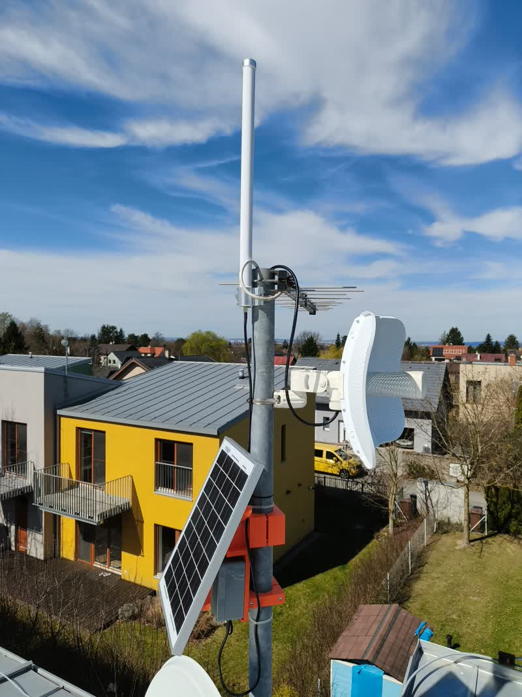

  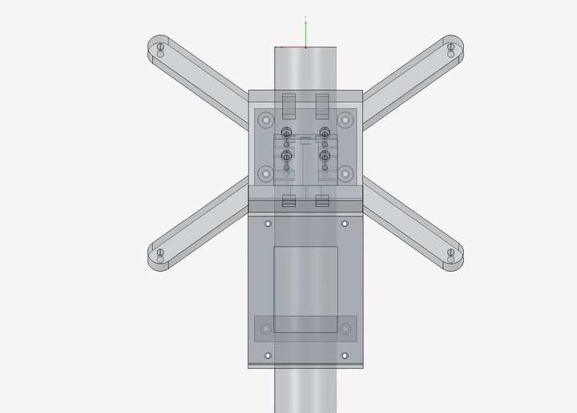

## Bill of Materials

| # | Component | Link | Image |
|---|-----------|------|-------|
| 1 | LaskaKit ART-CZ Meshtastic baseboard | [laskakit.cz](https://www.laskakit.cz/--art-cz-meshtastic-zakladni-deska/) | 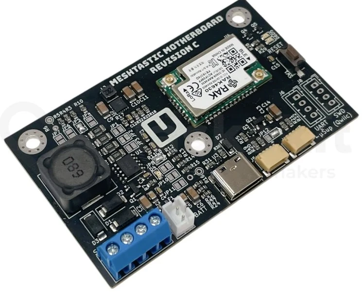 |
| 2 | U.FL to SMA female pigtail (1.13 mm, 15 cm) | [laskakit.cz](https://www.laskakit.cz/pigtail-u-fl-sma-female--kabel-1-13mm--15cm/) | 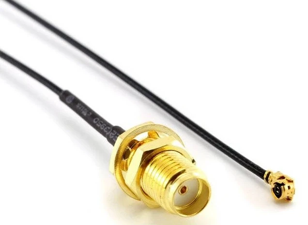 |
| 3 | Li-Ion battery pack 2×18650 1S2P 3.7 V 6400 mAh | [laskakit.cz](https://www.laskakit.cz/geb-li-ion-baterie-2x18650-1s2p-3-7v-6400mah/) | 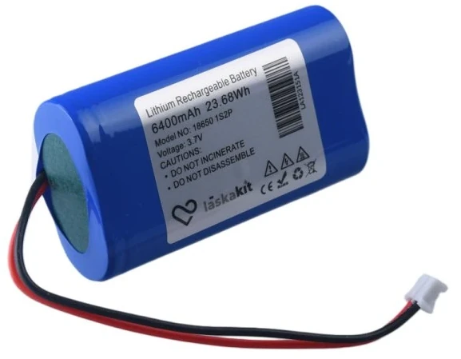 |
| 4 | Solar panel CL-SM10P (photovoltaic module) | [tme.eu](https://www.tme.eu/en/details/cl-sm10p/photovoltaic-modules/cellevia-power/) | 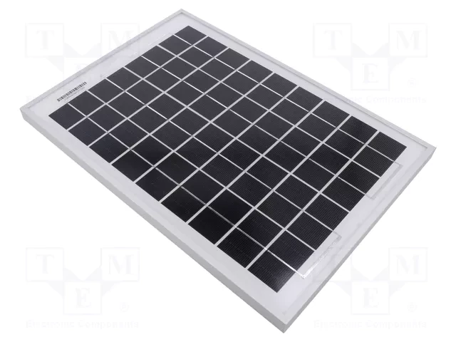 |
| 5 | Enclosure A311 IP68 | [tme.eu](https://www.tme.eu/en/details/a311-ip68/multipurpose-enclosures/gainta/) | 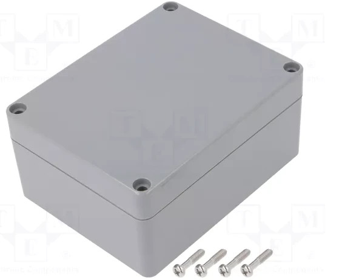 |
| 6 | DS1110-01-2B6 microphone connector (for solar input) | [tme.eu](https://www.tme.eu/en/details/ds1110-01-2b6/microphone-connectors/connfly/) | 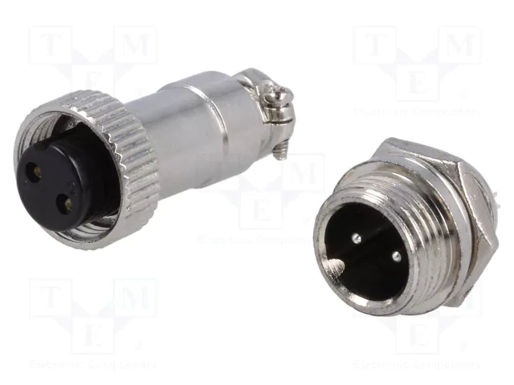 |
| 7 | Mikrotik antenna (or similar 868 MHz) | [i4wifi.cz](https://www.i4wifi.cz/cs/265996) | 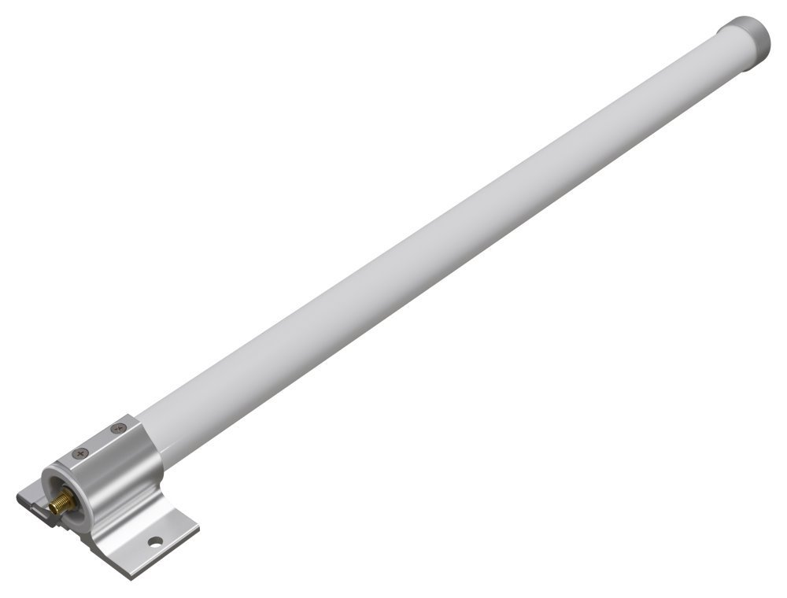 |

## Assembly

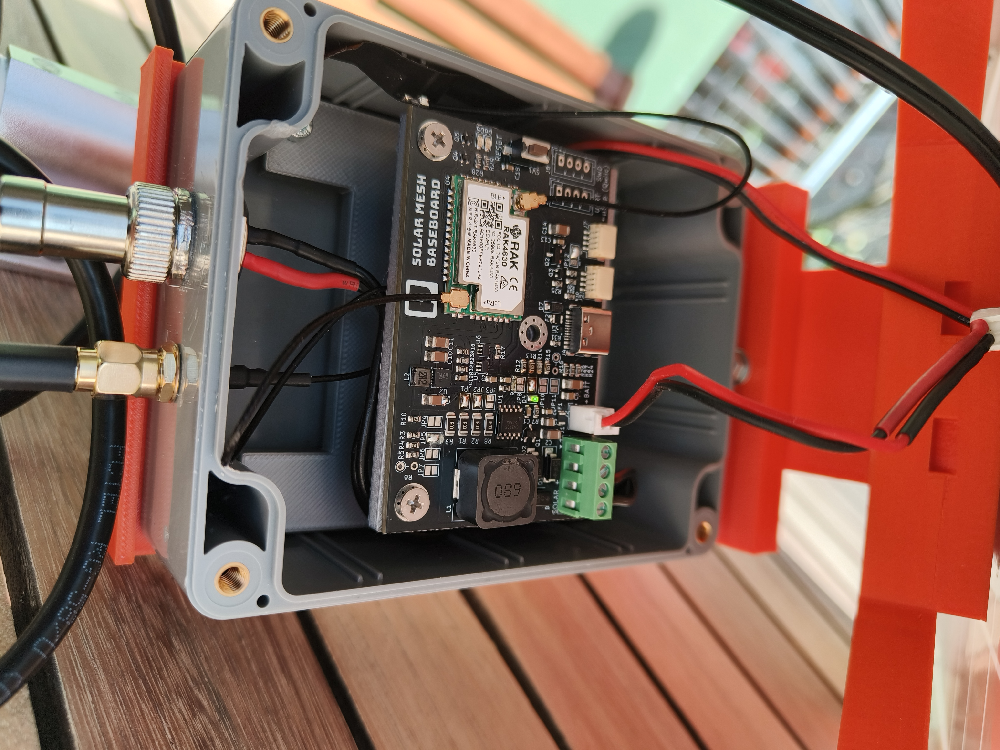

## 3D Model

The enclosure holder is designed in FreeCAD. Source file: [`model/solar_holder.FCStd`](model/solar_holder.FCStd)

> This is the first version of the design. There are several things I would improve — especially access to some of the screws, etc. But in the end, it holds together and works.

**Printable STL files** (in [`model/stl/`](model/stl/)):

- `solar_holder-arm.stl`
- `solar_holder-arm_back.stl`
- `solar_holder-box_holder.stl`
- `solar_holder-electronics_holder.stl`
- `solar_holder-solar_cross.stl`
- `solar_holder-spacer.stl`
- `solar_holder-spacer_back.stl`

## Important Notes

- The solar panel is tilted at **65°** — optimized for winter months when sunlight is scarce.
- **Never power on the device with antennas disconnected** — this can damage the RF module.
- Watch the **battery polarity** — you may need a JST connector with swapped polarity depending on your battery pack.

## First Pongs & Neighbors

The farthest repeater visible from this node is **57 km** away.

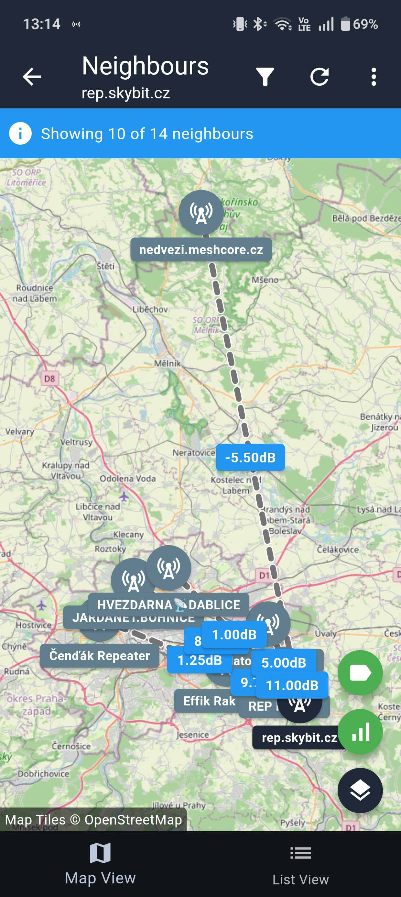
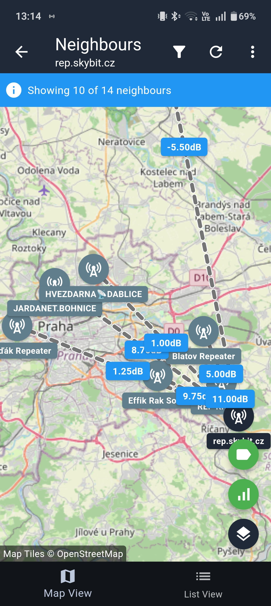

## Links

- [MeshCore repeater installation guide](https://meshcore.cz/instalace_repeateru)
- [LaskaKit ART-CZ Meshtastic baseboard](https://www.laskakit.cz/--art-cz-meshtastic-zakladni-deska/)
- [https://mapa.sftr.cz/#/live](https://mapa.sftr.cz/#/live)

## TODO

- [ ] Add detailed assembly instructions with step-by-step photos
- [ ] Document firmware flashing procedure
- [ ] Add wiring diagram
- [ ] Add range test results and coverage map
- [ ] Document power consumption and battery life estimates
